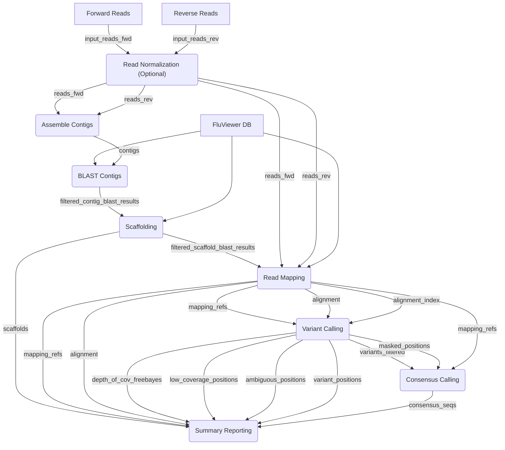
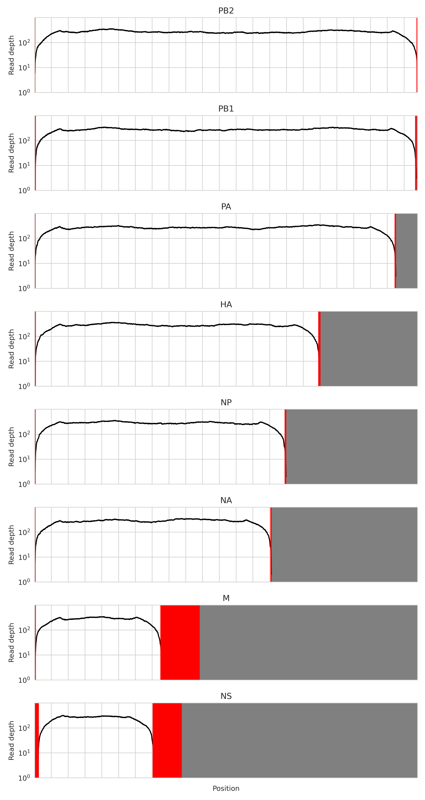

[](https://github.com/BCCDC-PHL/FluViewer/actions/workflows/consistency_check.yml)

# BCCDC-PHL/FluViewer

FluViewer is an automated pipeline for generating influenza A virus (IAV) genome sequences from FASTQ data. If provided with a sufficiently diverse and representative database of IAV reference sequences, it can generate sequences regardless of host and subtype without any human intervention required.

This codebase is derived from [KevinKuchinski/FluViewer](https://github.com/KevinKuchinski/FluViewer), with modifications applied to meet operational needs of BCCDC-PHL.

## Analysis Stages

0. **Read Normalization**: (Optional) The provided reads are normalized and downsampled using a kmer-based approach from [bbmap](https://sourceforge.net/projects/bbmap) called `bbnorm`. This reduces any excessive coverage of certain genome regions.

1. **Assemble Contigs**: The normalized/downsampled reads are assembled de novo into contigs with the [spades](https://github.com/ablab/spades) assembler.

2. **BLAST Contigs**: The contigs are then aligned to a database of IAV reference sequences using [BLAST](http://blast.ncbi.nlm.nih.gov/Blast.cgi?PAGE_TYPE=BlastDocs).
These alignments are used to trim contigs and roughly position them within their respective genome segment.

3. **Scaffolding**: A multiple sequencing alignment is conducted on the trimmed/positioned contigs using [clustalw](http://www.clustal.org), generating scaffold sequences for each IAV genome segment.
These scaffolds are aligned to the IAV reference sequence database to find their best matches.
These best matches are used to fill in any missing regions in the scaffold, creating mapping references.

4. **Read Mapping**: The normalized/downsampled reads are mapped to these mapping references using [bwa](https://github.com/lh3/bwa).

5. **Variant Calling**: Variants are called from the alignmnents generated by the read mapping stage using [freebayes](https://github.com/freebayes/freebayes)

6. **Consensus Calling**: Consensus sequences are generated using [bcftools](https://samtools.github.io/bcftools/bcftools.html) based on the variants that are detected between the best available reference and the mapped reads.

7. **Summary Reporting**: Summary reports and plots are generated.

### Analysis Summaries

Information is passed between analysis stage via 'analysis summaries'. These are implemented as python dictionaries, with the following structure:

```json
{
  "process_name": "bbnorm",
  "timestamp_analysis_start": "2024-06-11T11:28:37.142158",
  "timestamp_analysis_complete": "2024-06-11T11:29:03.860329",
  "return_code": 0,
  "inputs": {
    "input_reads_fwd": "/path/to/sample-01_R1.fastq.gz",
    "input_reads_rev": "/path/to/sample-01_R2.fastq.gz"
  },
  "outputs": {
    "normalized_reads_fwd": "/path/to/outdir/analysis_by_stage/00_normalize_depth/sample-01-normalized_R1.fastq.gz",
    "normalized_reads_rev": "/path/to/outdir/analysis_by_stage/00_normalize_depth/sample-01-normalized_R2.fastq.gz",
  }
}
```

Each stage selects its inputs from the `outputs` of the previous stages's analysis summary.

### Analysis Stage Diagram



## Installation
1. Create a virtual environment and install the necessary dependencies using the YAML file provided in this repository. For example, if using conda:

```
conda env create -n fluviewer -f environment.yaml
```

...or using mamba:

```
mamba env create -n fluviewer -f environment.yaml
```

2. Download and unzip the default FluViewer DB (FluViewer_db.fa.gz) provided in the [BCCDC-PHL/FluViewer-db](https://github.com/BCCDC-PHL/FluViewer-db) repository.
Custom DBs can be created and used as well (instructions below).

## Usage

```
usage: fluviewer [-h] -f FORWARD_READS -r REVERSE_READS -d DB [-o OUTDIR] -n OUTPUT_NAME [-i [0-100]] [-l [32-]] [-D [1-]] [-q [0-]] [-v [0-1]] [-V [0-1]] [-N [1-]] [-L [1-]] [-t [1-]] [-M [1-]] [-g] [--skip-depth-normalization]
                 [--force] [--log-level {info,debug}] [--version]

BCCDC-PHL/FluViewer: Influenza A virus consensus sequence generation and variant calling

optional arguments:
  -h, --help            show this help message and exit
  -f FORWARD_READS, --forward-reads FORWARD_READS
                        Path to FASTQ file containing forward reads
  -r REVERSE_READS, --reverse-reads REVERSE_READS
                        Path to FASTQ file containing reverse reads
  -d DB, --db DB        Path to FASTA file containing FluViewer database
  -o OUTDIR, --outdir OUTDIR
                        Output directory (default=FluViewer_<output-name>)
  -n OUTPUT_NAME, --output-name OUTPUT_NAME
                        Output name. Includes this name in output files, and in consensus sequence headers
  -i [0-100], --min-identity [0-100]
                        Minimum percent sequence identity between database reference sequences and contigs (default=90)
  -l [32-], --min-alignment-length [32-]
                        Minimum length of alignment between database reference sequences and contigs (default=50)
  -D [1-], --min-depth [1-]
                        Minimum read depth for base calling (default=20)
  -q [0-], --min-mapping-quality [0-]
                        Minimum PHRED score for mapping quality and base quality during variant calling (default=20)
  -v [0-1], --variant-threshold-calling [0-1]
                        Variant allele fraction threshold for calling variants (default=0.75)
  -V [0-1], --variant-threshold-masking [0-1]
                        Variant allele fraction threshold for masking ambiguous variants (default=0.25)
  -N [1-], --target-depth [1-]
                        Target depth for pre-normalization of reads (default=200)
  -L [1-], --coverage-limit [1-]
                        Coverage depth limit for variant calling (default=200)
  -t [1-], --threads [1-]
                        Threads used for contig/scaffold alignments (default=1)
  -M [1-], --max-memory [1-]
                        Gigabytes of memory allocated for normalizing reads (default=max)
  -g, --disable-garbage-collection
                        Disable garbage collection and retain intermediate analysis files
  --skip-depth-normalization
                        Skip read depth normalization (bbnorm) stage.
  --force               Allow overwrite of existing files and directories.
  --log-level {info,debug}
                        Log level (default=info)
  --version             show program's version number and exit
```

### Depth Normalization

Depending on the library preparation method used, some libraries get much higher depth of coverage near the
ends of each segment.
The `normalize_depth` stage is intended to normalize the depth-of-coverage across each segment to a consistent level, but this stage is optional. If you would like to skip the `normalize_depth` stage, simply add the `--skip-depth-normalization` flag. If that flag is used, the `assemble_contigs` stage will start directly with the set of reads supplied with the `--forward-reads` (`-f`) and `--reverse-reads` (`-r`) flags.

## FluViewer Database

FluViewer requires a curated FASTA file "database" of IAV reference sequences. Headers for these sequences must be formatted and annotated as follows:

```
>unique_id|strain_name(strain_subtype)|sequence_segment|sequence_subtype
```

Here are some example entries:

```
>CY230322|A/Washington/32/2017(H3N2)|PB2|none
TCAATTATATTCAGCATGGAAAGAATAAAAGAACTACGGAATCTAATGTCGCAGTCTCGCACTCGCGA...

>JX309816|A/Singapore/TT454/2010(H1N1)|HA|H1
CAAAAGCAACAAAAATGAAGGCAATACTAGTAGTTCTGCTATATACATTTACAACCGCAAATGCAGACA...

>MH669720|A/Iowa/52/2018(H3N2)|NA|N2
AGGAAAGATGAATCCAAATCAAAAGATAATAACGATTGGCTCTGTTTCTCTCACCATTTCCACAATATG...
```

For HA and NA segments, strain_subtype should reflect the HA and NA subtypes of the isolate (eg H1N1), but sequence_subtype should only
indicate the HA or NA subtype of the segment sequence of the entry (eg H1 for an HA sequence or N1 for an NA sequence).

For internal segments (i.e. PB2, PB1, PA, NP, M, and NS), strain_subtype should reflect the HA/NA subtypes of the isolate, but 'none'
should be entered for sequence_subtype. If strain_subtype is unknown, 'none' should be entered there as well.

FluViewer will only accept reference sequences composed entirely of uppercase canonical nucleotides (i.e. A, T, G, and C).

During analysis, FluViewer will check if a BLAST database has been built based on the fasta file that is supplied with the `-d` (or `--db`) flag,
by looking for the `.nhr`, `.nin` and `.nsq` BLAST database files associated with the fasta database. If any of those files are not found,
the BLAST database will be built using `makeblastdb`. FluViewer expects that it will be able to write those files alongside the fasta database when this occurs.

## FluViewer Output

FluViewer generates four main output files for each library:

1. A FASTA file containing consensus sequences for the IAV genome segments: `<out_name>_consensus_seqs.fa`
2. A sorted BAM file with reads mapped to the mapping references generated for that library: `<out_name>_alignment.bam` and `<out_name>_alignment.bam.bai`. The mapping reference is also retained: `<out_name>_mapping_refs.fa`
3. A report TSV file describing segment, subtype, and sequencing metrics for each consensus sequence generated: `<out_name>_report.tsv`
4. Depth of coverage plots for each segment: `<out_name>_depth_of_cov.png`

Headers in the FASTA file have the following format:

```
>output_name|segment|subject
```

### Summary Report

The report TSV files contain the following columns:

- `seq_name` : the name of the consensus sequence described by this row
- `segment` : IAV genome segment (PB2, PB1, PA, HA, NP, NA, M, NS)
- `subtype` : HA or NA subtype ("none" for internal segments)
- `reads_mapped` : the number of sequencing reads mapped to this segment (post-normalization/downsampling)
- `seq_length` : the length (in nucleotides) of the consensus sequence generated by FluViewer
- `scaffold_completeness` : the number of nucleotide positions in the scaffold that were assembled from the provided reads (post-normalization/downsampling)
- `consensus_completeness` : the number of nucleotide positions in the consensus with a succesful base call (e.g. A, T, G, or C)
- `ref_seq_used` : the unique ID and strain name of the scaffold's best-matching reference sequence used for filling in missing regions in the scaffold (if the scaffold completeness was 100%, then this is provided pro forma as none of it was used to create the mapping reference)

### Depth of Coverage Plot

The depth of coverage plots contains the following elements:

- A black line indicating the depth of coverage pre-variant calling
- A grey line indicating the depth of coverage post-variant calling
- Red shading covering positions where coverage was too low for base calling
- Orange lines indicating positions where excess variation resulted in an ambiguous base call
- Blue lines indicating positions where a variant was called

Below is an example depth of coverage plot. This plot shows outputs from simulated data that was
generated from sequences in the FluViewer database, so this represents 'ideal' outputs.


